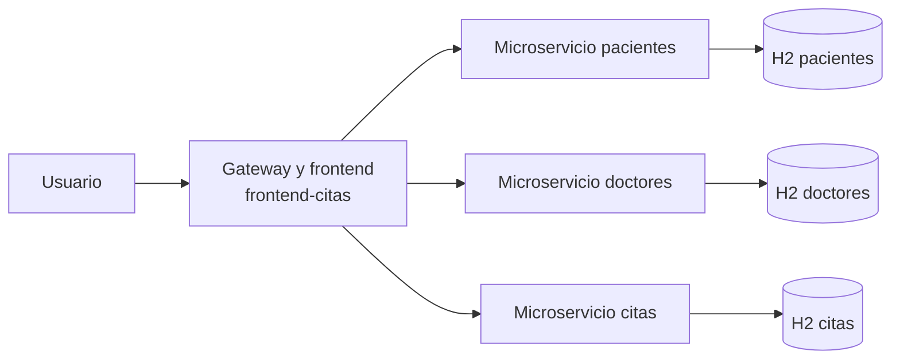
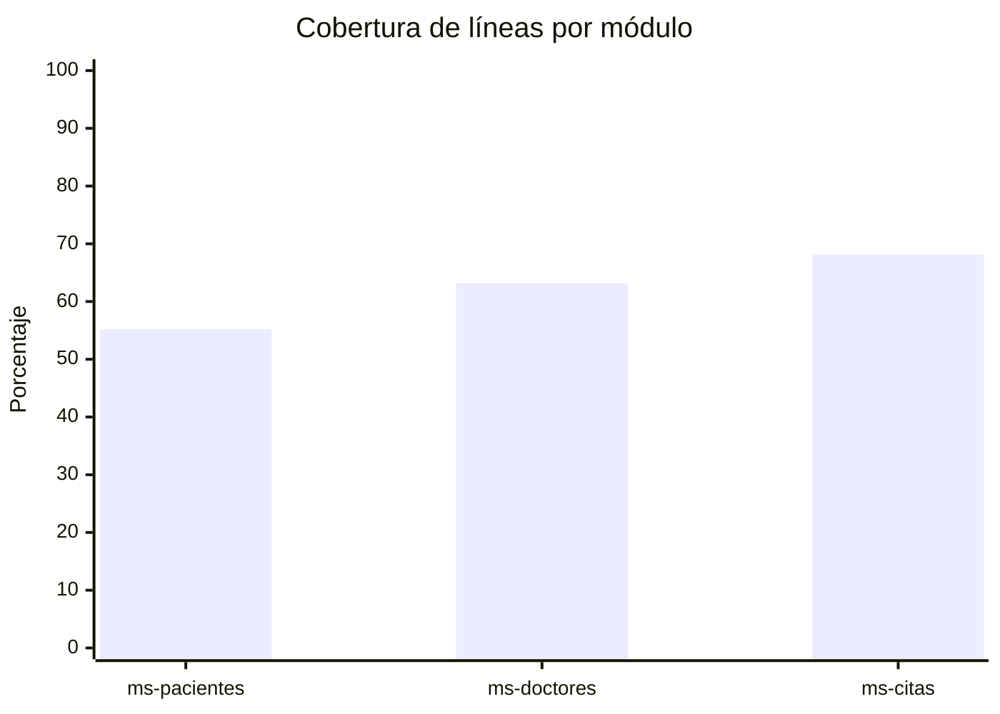
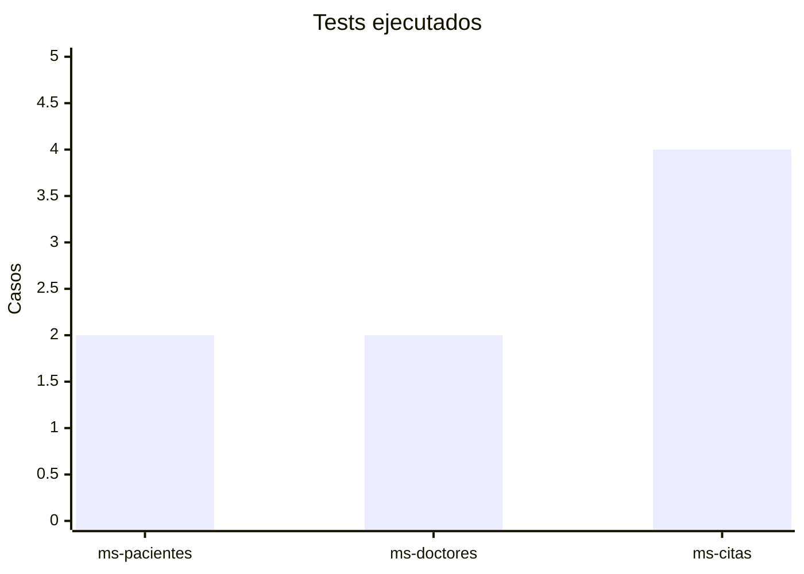

# Informe general del sistema

## 1. Descripción general

El sistema implementa una arquitectura de microservicios para gestionar pacientes, doctores y citas médicas. El acceso se centraliza a través de un gateway que expone una interfaz web y enruta las peticiones a los servicios backend.

## 2. Arquitectura

### Componentes

- `frontend-citas`: interfaz web estática y gateway.
- `ms-pacientes`: altas, listado y búsqueda de pacientes.
- `ms-doctores`: altas, listado y búsqueda de doctores.
- `ms-citas`: agendamiento, disponibilidad y cancelación.

## 3. Persistencia

La persistencia se resolvió con H2 en modo archivo para evitar la pérdida de datos al detener o reiniciar contenedores.

### Configuración aplicada

- Pacientes: `jdbc:h2:file:./data/pacientesdb`
- Doctores: `jdbc:h2:file:./data/doctoresdb`
- Citas: `jdbc:h2:file:./data/citasdb`

### Evidencia de persistencia

Se validó creando registros, reiniciando el contenedor correspondiente y verificando que los datos seguían disponibles.

## 4. Documentación API

Cada backend expone Swagger/OpenAPI para consultar y probar los endpoints.

## 5. Pruebas unitarias

Se implementaron pruebas unitarias focalizadas en la capa de servicio con JUnit 5 y Mockito.

### Resultados de pruebas

| Módulo | Tests | Fallos | Errores | Omitidos |
| --- | ---: | ---: | ---: | ---: |
| ms-pacientes | 2 | 0 | 0 | 0 |
| ms-doctores | 2 | 0 | 0 | 0 |
| ms-citas | 4 | 0 | 0 | 0 |

## 6. Cobertura JaCoCo

### Cobertura por módulo

| Módulo | Líneas | Instrucciones | Métodos | Clases | Ramas |
| --- | ---: | ---: | ---: | ---: | ---: |
| ms-pacientes | 55.22% | 53.66% | 63.89% | 42.86% | 0.00% |
| ms-doctores | 63.16% | 61.79% | 73.81% | 42.86% | 0.00% |
| ms-citas | 68.14% | 67.76% | 73.21% | 55.56% | 62.50% |

### Cobertura global del backend

| Métrica | Valor |
| --- | ---: |
| Líneas | 63.28% |
| Instrucciones | 62.37% |
| Métodos | 70.90% |
| Clases | 47.83% |
| Ramas | 41.67% |

## 7. Gráficos sugeridos para el PDF

### Gráfico 1: cobertura por módulo

### Gráfico 2: resumen de pruebas

## 9. Recursos generados

- HTML imprimible: [informe-general.html](informe-general.html)
- Diagrama de arquitectura: [images/arquitectura.svg](images/arquitectura.svg)
- Gráfico de métricas: [images/metricas.svg](images/metricas.svg)
